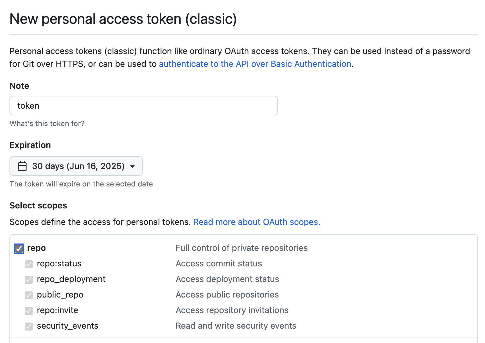
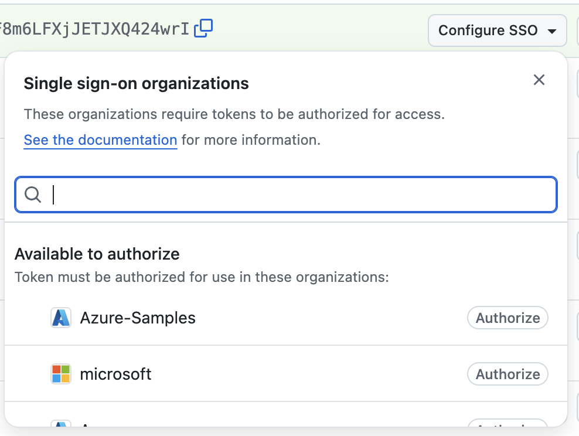

# Install Foundry Local on mac

If you are seeing this README, then you have access to this private repo and you have the ability to install the Foundry Local mac installer.

Once Foundry Local is in Public Preview, this repo will be public and you will not need to authorize with a token.

## Install for mac when you are an external contributor

1. Create a GitHub PAT (personal access token):
   - In your GitHub account, go to `Settings -> Developer Settings`
   - Generate new token (classic)
   - Click the `repo` button to give your token acccess to the private repo
     
   - Press `Generate Token` and copy the token value

 2. Set HOMEBREW_GITHUB_API_TOKEN:
    - `export HOMEBREW_GITHUB_API_TOKEN=<Github_TOKEN>`

 3. Install Foundry Local using homebrew
    - `brew install microsoft/foundrylocal/foundrylocal`

## Install for mac when you are a Microsoft employees

Note: these instructions assume you are using your personal GitHub account and it is linked with the Microsoft GitHub organization.

1. Create a GitHub PAT (personal access token):
   - In your GitHub account, go to `Settings -> Developer Settings`
   - Generate new token (classic)
   - Click the `repo` button to give your token acccess to the private repo
     
   - Press `Generate Token` and copy the token value
   - **Configure SSO and authorize Microsoft**
     

 2. Set HOMEBREW_GITHUB_API_TOKEN:
    - `export HOMEBREW_GITHUB_API_TOKEN=<Github_TOKEN>`

 3. Install Foundry Local using homebrew
    - `brew install microsoft/foundrylocal/foundrylocal`

## Update to new release

`brew update`

## Uninstall

`brew rm foundrylocal`

## Reset everything

```
brew rm foundrylocal
brew untap microsoft/foundrylocal
brew cleanup --scrub
```

## Contributing

This project welcomes contributions and suggestions.  Most contributions require you to agree to a
Contributor License Agreement (CLA) declaring that you have the right to, and actually do, grant us
the rights to use your contribution. For details, visit https://cla.opensource.microsoft.com.

When you submit a pull request, a CLA bot will automatically determine whether you need to provide
a CLA and decorate the PR appropriately (e.g., status check, comment). Simply follow the instructions
provided by the bot. You will only need to do this once across all repos using our CLA.

This project has adopted the [Microsoft Open Source Code of Conduct](https://opensource.microsoft.com/codeofconduct/).
For more information see the [Code of Conduct FAQ](https://opensource.microsoft.com/codeofconduct/faq/) or
contact [opencode@microsoft.com](mailto:opencode@microsoft.com) with any additional questions or comments.

## Trademarks

This project may contain trademarks or logos for projects, products, or services. Authorized use of Microsoft
trademarks or logos is subject to and must follow
[Microsoft's Trademark & Brand Guidelines](https://www.microsoft.com/en-us/legal/intellectualproperty/trademarks/usage/general).
Use of Microsoft trademarks or logos in modified versions of this project must not cause confusion or imply Microsoft sponsorship.
Any use of third-party trademarks or logos are subject to those third-party's policies.

## Security

Microsoft takes the security of our software products and services seriously, which includes all source code repositories managed through our GitHub organizations, which include [Microsoft](https://github.com/Microsoft), [Azure](https://github.com/Azure), [DotNet](https://github.com/dotnet), [AspNet](https://github.com/aspnet) and [Xamarin](https://github.com/xamarin).

If you believe you have found a security vulnerability in any Microsoft-owned repository that meets [Microsoft's definition of a security vulnerability](https://aka.ms/security.md/definition), please report it to us as described below.

## Reporting Security Issues

**Please do not report security vulnerabilities through public GitHub issues.**

Instead, please report them to the Microsoft Security Response Center (MSRC) at [https://msrc.microsoft.com/create-report](https://aka.ms/security.md/msrc/create-report).

If you prefer to submit without logging in, send email to [secure@microsoft.com](mailto:secure@microsoft.com).  If possible, encrypt your message with our PGP key; please download it from the [Microsoft Security Response Center PGP Key page](https://aka.ms/security.md/msrc/pgp).

You should receive a response within 24 hours. If for some reason you do not, please follow up via email to ensure we received your original message. Additional information can be found at [microsoft.com/msrc](https://www.microsoft.com/msrc).

Please include the requested information listed below (as much as you can provide) to help us better understand the nature and scope of the possible issue:

  * Type of issue (e.g. buffer overflow, SQL injection, cross-site scripting, etc.)
  * Full paths of source file(s) related to the manifestation of the issue
  * The location of the affected source code (tag/branch/commit or direct URL)
  * Any special configuration required to reproduce the issue
  * Step-by-step instructions to reproduce the issue
  * Proof-of-concept or exploit code (if possible)
  * Impact of the issue, including how an attacker might exploit the issue

This information will help us triage your report more quickly.

If you are reporting for a bug bounty, more complete reports can contribute to a higher bounty award. Please visit our [Microsoft Bug Bounty Program](https://aka.ms/security.md/msrc/bounty) page for more details about our active programs.

### Preferred Languages

We prefer all communications to be in English.

### Policy

Microsoft follows the principle of [Coordinated Vulnerability Disclosure](https://aka.ms/security.md/cvd).
